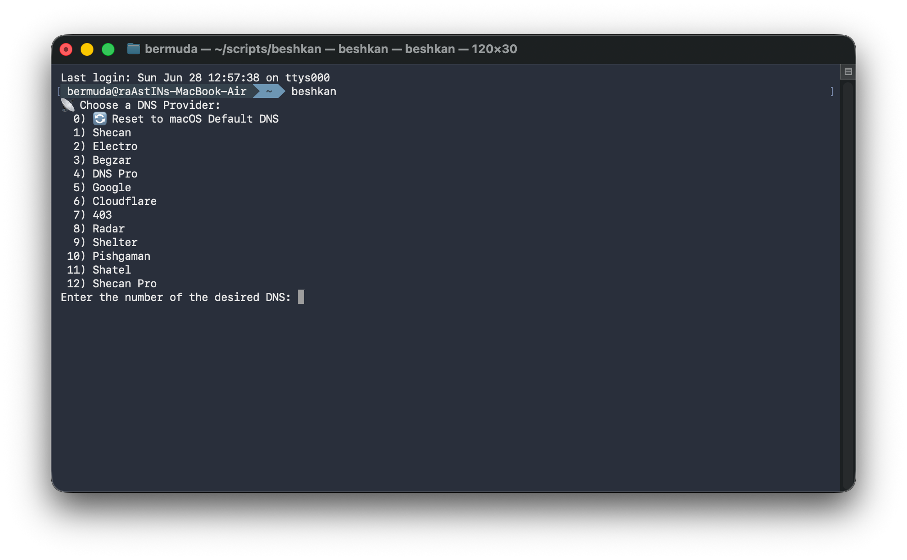

<div align="center">



# Beshkan

### Fast DNS Switcher for macOS, Linux & Windows

[](LICENSE)
[]()
[]()
[]()

A blazing-fast CLI tool to switch between DNS providers with a single command.
Built for developers, power users, and anyone who needs quick DNS management.

</div>

---

## Features

- **Cross-Platform** — Works on macOS, Linux, and Windows
- **11 DNS Providers** — Iranian & international providers pre-configured
- **One-Click Switch** — Interactive menu, select and done
- **Zero Dependencies** — Uses built-in OS tools only
- **Status Check** — View current DNS settings instantly
- **Color Output** — Clean, readable terminal experience

## Supported DNS Providers

| # | Provider   | Primary DNS      | Secondary DNS    |
|---|------------|------------------|------------------|
| 1 | Shecan     | `178.22.122.100` | `185.51.200.2`   |
| 2 | Electro    | `78.157.42.100`  | `78.157.42.101`  |
| 3 | Begzar     | `185.55.226.26`  | `185.55.226.25`  |
| 4 | DNS Pro    | `87.107.110.109` | `87.107.110.110` |
| 5 | Google     | `8.8.8.8`        | `8.8.4.4`        |
| 6 | Cloudflare | `1.1.1.1`        | `1.0.0.1`        |
| 7 | 403        | `10.202.10.202`  | `10.202.10.102`  |
| 8 | Radar      | `10.202.10.10`   | `10.202.10.11`   |
| 9 | Shelter    | `94.103.125.157` | `94.103.125.158` |
| 10| Pishgaman  | `5.202.100.100`  | `5.202.100.101`  |
| 11| Shatel     | `85.15.1.14`     | `85.15.1.15`     |

## Quick Start

### One-Line Install (macOS / Linux)

```bash
curl -fsSL https://raw.githubusercontent.com/raAstIN/Beshkan/main/install.sh | bash
```

### Manual Install

```bash
# Clone the repository
git clone https://github.com/raAstIN/Beshkan.git
cd Beshkan

# Make executable
chmod +x beshkan-macos.sh   # or beshkan-linux.sh

# Move to PATH
sudo cp beshkan-macos.sh /usr/local/bin/beshkan    # macOS
sudo cp beshkan-linux.sh /usr/local/bin/beshkan-linux  # Linux
```

### Windows (PowerShell)

```powershell
# Download beshkan-windows.ps1 from the repository
# Run PowerShell as Administrator
.\beshkan-windows.ps1
```

## Usage

```bash
# Launch interactive DNS selector
beshkan

# Check current DNS settings
beshkan --status

# Show help
beshkan --help

# Show version
beshkan --version
```

### Example Session

```
$ beshkan

Choose a DNS Provider:
  0)  Reset to macOS Default DNS
  1)  Shecan
  2)  Electro
  ...
  6)  Cloudflare
  ...

Enter the number of the desired DNS: 6

Applying DNS settings...
  Wi-Fi: Set to Cloudflare
  Ethernet: Set to Cloudflare

Done! 2 service(s) updated, 0 failed.
```

## Project Structure

```
Beshkan/
├── README.md              # This file
├── LICENSE                 # MIT License
├── install.sh             # Cross-platform installer
├── beshkan-macos.sh       # macOS version
├── beshkan-linux.sh       # Linux version
├── beshkan-windows.ps1    # Windows PowerShell version
└── .github/
    └── FUNDING.yml        # Sponsorship config
```

## How It Works

| Platform   | Tool Used           | Method                                    |
|------------|---------------------|-------------------------------------------|
| macOS      | `networksetup`      | Modifies system DNS per network service   |
| Linux      | `nmcli` / `resolvectl` | Updates NetworkManager or systemd-resolved |
| Windows    | PowerShell          | Uses `Set-DnsClientServerAddress` cmdlet  |

## Requirements

| Platform   | Requirements                              |
|------------|-------------------------------------------|
| macOS      | macOS 10.12+, `networksetup` (built-in)  |
| Linux      | NetworkManager (`nmcli`) or systemd-resolved |
| Windows    | PowerShell 5.1+, Administrator access    |

## Contributing

Contributions are welcome! Feel free to:

1. Fork the repository
2. Create a feature branch (`git checkout -b feature/amazing-feature`)
3. Commit your changes (`git commit -m 'Add amazing feature'`)
4. Push to the branch (`git push origin feature/amazing-feature`)
5. Open a Pull Request

## License

This project is licensed under the MIT License — see the [LICENSE](LICENSE) file for details.

## Author

**raAstIN** — [GitHub](https://github.com/raAstIN)

---

<div align="center">

**Beshkan** — Switch DNS. Stay fast.

</div>
